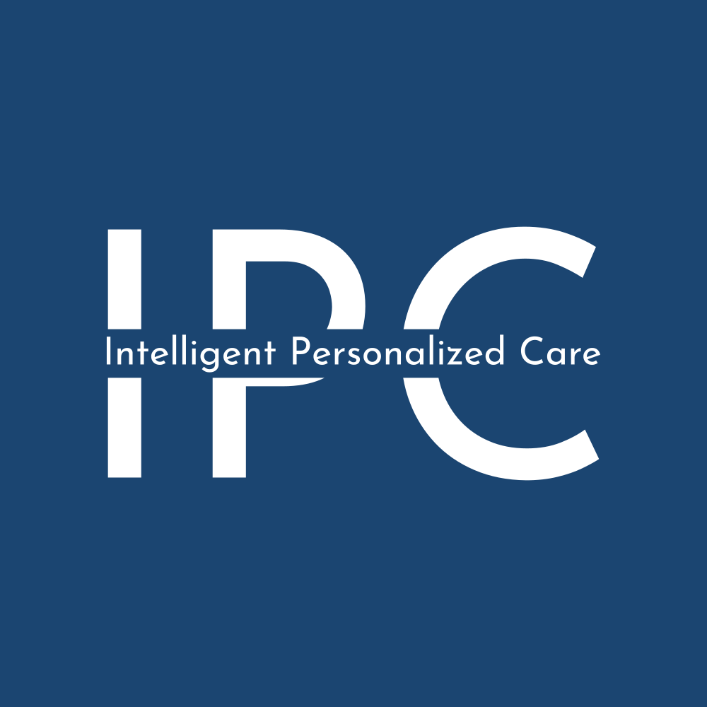

<h1 align="center">
    

 

    Intelligent Personalized Care
</h1>
<h4 align="center">An Android application to promote physical agility and recovery.</h4>
 

> Developed in the scope of a final bachelor degree project in Computer Science and Engineering, at [ISEL](https://www.isel.pt/).

The Intelligent Personalized Care project aims to respond to the rapidly increasing sedentary lifestyle and isolation of the population. Using advanced artificial intelligence technologies to provide personalized and effective remote care for patients in different health scenarios, it will be possible to reduce and prevent sedentary lifestyle, and promote physical exercise and rehabilitation in people. 

This project is based on an Android application to promote physical agility and recovery, through (tele) exercise and (tele) rehabilitation using immersive approaches with vision techniques and artificial intelligence. In addition, the application will offer advanced patient monitoring and follow-up features, allowing physiotherapists to monitor the patient progress. 

---

## Languages

We focused on choosing **_Kotlin_** as the master language, both in the backend and frontend. We are using **_Postgresql_** in the database.

## Frameworks / Libraries

This project uses the following open source packages:

* [Spring](https://spring.io/)
* [JDBI](https://jdbi.org/)
* [Jetpack Compose](https://developer.android.com/jetpack/compose)
* [Google Cloud Storage](https://cloud.google.com/storage)
* [ML Kit – API Pose Detection](https://developers.google.com/ml-kit/vision/pose-detection)

---

## Authors

* [Guilherme Cepeda](https://github.com/bodeborder)
* [Rodrigo Neves](https://github.com/RodrigoNevesWork)
* [Tiago Martinho](https://github.com/tiagomartinhoo)

## Supervisor

* [Paulo Pereira](https://github.com/palbp) , ISEL
